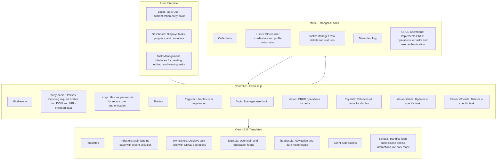

# CODE Student Task Manager

## Overview
The Student Task Manager is designed specifically for students at CODE University of Applied Sciences in Berlin. This app organizes tasks and projects in one place to make student life easier.

## Problem
Students often use multiple tools like Google Calendar, Notion, and Slack. Juggling these platforms can be confusing and time-consuming.

## Importance
Centralizing tools means less time switching between apps and more focus on learning and projects. This app integrates these tools, simplifying task and schedule management.

## Goals
- **Centralized Hub**: Combine daily tools into one platform.
- **Seamless Integration**: Sync with Google Calendar and Notion.
- **Easy to Use**: User-friendly interface for everyone.

## Features
- **Dashboard**: Overview of tasks, progress, priorities, activities, and reminders.
- **My Lists**: Manage task lists for projects or subjects.
- **New Lists**: Add new lists for projects or organization.
- **Completed Tasks**: Track and review completed tasks.
- **Settings**: Customize preferences and update profiles.
- **Login**: Secure access to tasks and information.
- **Dark Mode**: Toggle dark mode with preferences saved for future logins.

## Backend Implementation
- **Static Routes**: For pages like Dashboard, My Lists, New Lists, Completed Tasks, Settings, and Login.
- **Dynamic Route**: `/tasks/:id` for accessing task pages with unique URLs.

## Installation

### Prerequisites
- Node.js and npm installed
- MongoDB Atlas account

### Steps
1. **Clone the Repository**
   ```bash
   git clone https://github.com/lamSompa/CODE_Student_Task-Manager
   ```
2. **Install Dependencies**
   ```bash
   npm install
   ```
3. **Set Up MongoDB**
   - Update the MongoDB URL in `server.js` with your credentials.

#### Environment Variables and Configuration
Before starting the server, ensure that you have set up the necessary environment variables and configuration files. This is crucial for connecting to MongoDB and other services your application might use.

- **MongoDB Connection String:**
  - Create a .env file in the root directory of your project.
  - Add your MongoDB connection string to the .env file:
    ```
    MONGODB_URI=your_mongodb_connection_string
    ```
  - Replace `your_mongodb_connection_string` with the actual connection string provided by MongoDB Atlas or your MongoDB service.

- **Other Environment Variables:**
  - If your application uses other services (e.g., email services, third-party APIs), ensure you add their respective environment variables in the .env file.
  - Example:
    ```
    API_KEY=your_api_key
    SECRET_KEY=your_secret_key
    ```

- **Configuration Files:**
  - Ensure any configuration files required by your application are correctly set up and point to the right resources or endpoints.

- **Loading Environment Variables:**
  - Ensure your application is set up to load these environment variables. If you are using Node.js, you can use the dotenv package to load variables from the .env file:
    ```
    require('dotenv').config();
    ```

4. **Start the Server**
   ```bash
   node server.js
   ```
5. **Access the App**
   - Open your browser and navigate to `http://localhost:3000`.

## Usage
- **Dashboard**: Get an overview of tasks and activities.
- **Manage Lists**: Use 'My Lists' and 'New Lists' to organize tasks.
- **Track Progress**: Check 'Completed Tasks' for accomplishments.
- **Customize Settings**: Adjust preferences in the settings page.

## Code Structure

### Server (server.js)
- **Express Setup**: Configures Express, EJS, and MongoDB.
- **User Authentication**: Handles registration and login with bcrypt for password hashing.
- **Task Management**: CRUD operations for tasks using MongoDB.

### Client (script.js)
- **Dark Mode**: Toggles dark mode and saves preference in local storage.
- **Form Handling**: Manages login and registration form submissions.

### Views (EJS Templates)
- **index.ejs**: Landing page with recent activities and task overview.
- **my-lists.ejs**: Displays tasks with CRUD operations.
- **login.ejs**: Handles user login and registration.
- **header.ejs**: Contains navigation and dark mode toggle.

## Software Architecture

The Student Task Manager is built using a Model-View-Controller (MVC) architecture, which separates the application into three interconnected components:

### Model
- **Database**: Utilizes MongoDB Atlas to store user data and tasks.
- **Data Handling**: Manages CRUD operations for tasks and user authentication.

### View
- **EJS Templates**: Renders dynamic HTML pages for the user interface.
- **Client-Side Scripts**: Handles interactions like form submissions and dark mode toggling.

### Controller
- **Express.js**: Manages HTTP requests and routes them to appropriate handlers.
- **Middleware**: Uses body-parser for request parsing and bcrypt for password hashing.

### Workflow
1. **User Interaction**: Users interact with the app through a web interface.
2. **Request Handling**: Express.js routes requests to the appropriate controller functions.
3. **Data Processing**: Controller functions interact with the MongoDB database to process data.
4. **Response Rendering**: EJS templates render the response, updating the user interface.

This architecture ensures a clear separation of concerns, making the application scalable and maintainable.

## Diagram


## API Documentation
- **POST /register**: Register a new user.
- **POST /login**: User login.
- **POST /tasks**: Create a new task.
- **GET /my-lists**: Retrieve all tasks.
- **POST /tasks/:id/edit**: Update a task.
- **POST /tasks/:id/delete**: Delete a task.

## Contributing
Contributions are welcome! Fork the project and submit a pull request with ideas or improvements.

## License
This project is licensed under the MIT License.

## Contact
For questions or feedback, contact me at [abeikusompa.nyarkolartey@code.berlin](mailto:abeikusompa.nyarkolartey@code.berlin).